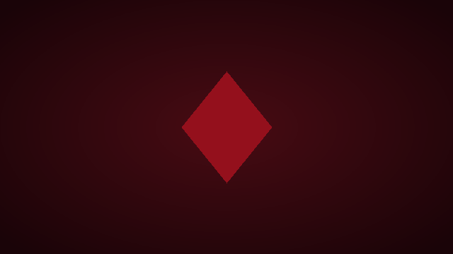

# Sanguophage Lair

> A RimWorld mod adding a rare sanguophage lair world quest site with a custom portal and pocket map

## About

Sanguophages haunt RimWorld's lore as ancient, scheming predators - but in vanilla Biotech you mostly meet them one waster-thrall camp at a time. This mod gives them a home worth raiding: a rare world quest site concealing a true sanguophage lair.

- **Rare world quest site** - A sanguophage lair surfaces on the world map through the opportunity-site quest pool
- **Custom portal** - Descend through the lair's entrance into a self-contained underground complex
- **Generated pocket map** - A custom map-generator pipeline builds each lair: an ancient sanguophage, its thralls, and hemogen-soaked treasures

## Features

### The Lair

- **Portal descent**: The surface site conceals an entrance; the real lair is a pocket map below
- **Custom map generation**: A dedicated MapGeneratorDef subtree lays out the lair's chambers, inhabitants, and loot
- **Configurable commonality**: Tune how often the quest is offered (or disable it) in mod settings

## Requirements

- **RimWorld 1.6** or later
- **Biotech DLC** (required - the lair is built on Biotech's sanguophage xenotype, genes, and hemogen systems)
- **Harmony** (auto-download from Steam Workshop if you don't have it)

## Installation

### Steam Workshop (Recommended)

Coming with the first release.

### Manual Installation

1. Download the latest release from the [Releases](https://github.com/sam-hunt/SanguophageLair/releases) page
2. Extract the `SanguophageLair` folder to your RimWorld `Mods` directory:
   - **Windows**: `C:\Program Files (x86)\Steam\steamapps\common\RimWorld\Mods\`
   - **Mac**: `~/Library/Application Support/Steam/steamapps/common/RimWorld/RimWorldMac.app/Mods/`
   - **Linux**: `~/.steam/steam/steamapps/common/RimWorld/Mods/`
3. Enable the mod in RimWorld's mod menu
4. Restart RimWorld

## Compatibility

- **Safe to add** to existing saves.
- **Not safe to remove** from saves.
- Not tested with Combat Extended.

## Contributing

Bug reports and feature requests welcome on [GitHub Issues](https://github.com/sam-hunt/SanguophageLair/issues).
Please attach any relevant logs/stack traces/mod lists etc

Translations are welcome — see [CONTRIBUTING.md](CONTRIBUTING.md).
For development setup, see [CLAUDE.md](CLAUDE.md).

## Credits

**Author**: Sam Hunt ([@sam-hunt](https://github.com/sam-hunt))

**Built With**:

- [Harmony](https://github.com/pardeike/Harmony) by Andreas Pardeike - Runtime patching library
- RimWorld modding API, community examples

**Special Thanks**:

- [Ludeon Studios](https://ludeon.com) for RimWorld and modding API
- [The RimWorld modding community](https://steamcommunity.com/app/294100/workshop/) for inspiration and working examples
- [Claude Code](https://claude.com/claude-code) for breathing C#
